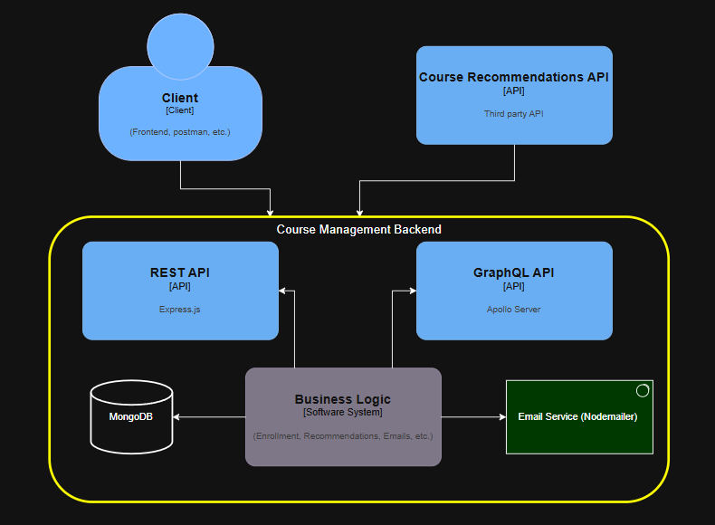
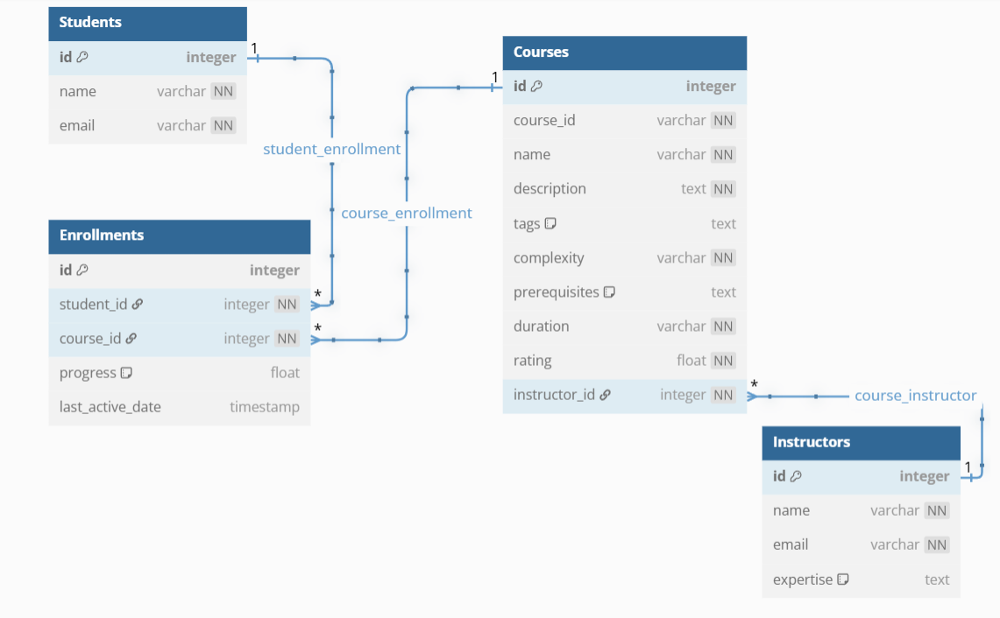

### **Overview of the Application**

This application is a **Online Learning Platform** that provides both **REST API** and **GraphQL API** for managing courses, students, and instructors. It integrates with a **MongoDB database** for data storage and includes features like email notifications and API documentation.

---

### **Key Features**

#### 1. **REST API**
- Provides endpoints for managing:
  - **Courses**: CRUD operations for courses.
  - **Students**: CRUD operations for students, including enrollment in courses.
  - **Instructors**: CRUD operations for instructors, including assigning courses.
- API documentation is available via **Swagger UI**.

#### 2. **GraphQL API**
- Offers a flexible and efficient way to query and mutate data.
- Supports:
  - Fetching all or specific courses, students, and instructors.
  - Creating, updating, and deleting entities.
  - Enrolling students in courses.
  - Fetching course recommendations.

#### 3. **Database**
- Uses **MongoDB** as the database.
- Models are defined using **Mongoose** for schema validation and relationships:
  - **Student**: Tracks student details and their enrolled courses.
  - **Course**: Tracks course details and the instructor assigned to the course.
  - **Instructor**: Tracks instructor details and their expertise.

#### 4. **Email Notifications**
- Sends a welcome email to students upon creation.
- Uses **Nodemailer** for email delivery.

#### 5. **API Documentation**
- REST API documentation is available via **Swagger UI** at `/api-docs`.
- GraphQL API schema can be explored using **GraphQL Playground** or **Apollo Sandbox**.

#### 6. **Cloud Deployment**
- Application is deployed at:  
     [https://ignited-psi.vercel.app/](https://ignited-psi.vercel.app/)..

#### 7. **Course Recommendations**:
- Provides recommendations for a course based on its tags.
- Uses a third-party API hosted at:  
    [https://course-recommendations-api.vercel.app/](https://course-recommendations-api.vercel.app/).
---

## **Setup Instructions for Local Development**

### **Prerequisites**
1. **Node.js**: Install Node.js (v14.x or higher) from [Node.js Official Website](https://nodejs.org/).
2. **MongoDB**: Install MongoDB locally or use a cloud-based MongoDB service like [MongoDB Atlas](https://www.mongodb.com/atlas).
3. **Git**: Ensure Git is installed for cloning the repository.

### **Steps to Set Up Locally**
1. **Clone the Repository**:
   ```bash
   git clone https://github.com/pkinnera07/courses-api.git
   cd courses-api
   ```

2. **Install Dependencies**:
   ```bash
   npm install
   ```

3. **Set Up Environment Variables**:
   Create a .env file in the root directory and add the following:
   ```
   PORT=5000
   MONGO_URI=mongodb+srv://<username>:<password>@cluster.mongodb.net/<database>?retryWrites=true&w=majority
   EMAIL_USER=your-email@example.com
   EMAIL_PASS=your-email-password
   RECOMMENDATIONS_API_URL=https://course-recommendations-api.vercel.app/
   ```

4. **Start the MongoDB Server**:
   - If MongoDB is installed locally, start the MongoDB server:
     ```bash
     mongod
     ```
   - If using MongoDB Atlas, ensure the connection string in `MONGO_URI` is correct.

5. **Run the Application**:
   ```bash
   npm start
   ```

6. **Access the Application**:
   - REST API: `http://localhost:5000/api`
   - Swagger Documentation: `http://localhost:5000/api-docs`
   - GraphQL API: `http://localhost:5000/graphql`

---

## **Deployment Instructions**

### **Deploying to Vercel**
1. **Clone the Repository**:
   ```bash
   git clone https://github.com/pkinnera07/courses-api.git
   cd courses-api
   ```

2. **Install the Vercel CLI**:
   ```bash
   npm install -g vercel
   ```

3. **Login to Vercel**:
   ```bash
   vercel login
   ```

4. **Deploy the Application**:
   ```bash
   vercel
   ```

5. **Set Environment Variables**:
   - Go to your Vercel project dashboard.
   - Add the following environment variables:
     ```
     MONGO_URI=<your-mongo-uri>
     EMAIL_USER=<your-email>
     EMAIL_PASS=<your-email-password>
     RECOMMENDATIONS_API_URL=https://course-recommendations-api.vercel.app/
     ```

6. **Access the Deployed Application**:
   - Application URL: [https://ignited-psi.vercel.app/](https://ignited-psi.vercel.app/)
   - Swagger Documentation: [https://ignited-psi.vercel.app/api-docs](https://ignited-psi.vercel.app/api-docs)
   - GraphQL API: [https://ignited-psi.vercel.app/graphql](https://ignited-psi.vercel.app/graphql)

---

### **Core Functionalities**

#### **Courses**
- **Create a Course**: Add a new course with details like name, description, tags, complexity, prerequisites, duration, and rating.
- **Fetch Courses**: Retrieve all courses or a specific course by ID.
- **Update a Course**: Modify course details.
- **Delete a Course**: Remove a course from the system.

#### **Students**
- **Create a Student**: Add a new student and send a welcome email.
- **Fetch Students**: Retrieve all students or a specific student by ID.
- **Update a Student**: Modify student details.
- **Delete a Student**: Remove a student from the system.
- **Enroll in a Course**: Enroll a student in a specific course.

#### **Instructors**
- **Create an Instructor**: Add a new instructor with expertise areas.
- **Fetch Instructors**: Retrieve all instructors or a specific instructor by ID.
- **Update an Instructor**: Modify instructor details.
- **Delete an Instructor**: Remove an instructor from the system.
- **Assign Courses**: Assign courses to an instructor.

---

### **Technology Stack**

#### **Backend**
- **Node.js**: JavaScript runtime for building the server.
- **Express.js**: Web framework for REST API and middleware integration.
- **Apollo Server**: For GraphQL API implementation.

#### **Database**
- **MongoDB**: NoSQL database for storing application data.
- **Mongoose**: ODM library for schema validation and database interaction.

#### **Email Service**
- **Nodemailer**: For sending email notifications.

#### **Documentation**
- **Swagger UI**: For REST API documentation.
- **GraphQL Playground**: For exploring and testing GraphQL API.

#### **Deployment**
- **Vercel**: For cloud deployment.

---

### **How It Works**

1. **REST API**:
   - Users can interact with the application via REST endpoints (e.g., `/api/students`, `/api/courses`).
   - Swagger UI provides a user-friendly interface to test and explore the API.

2. **GraphQL API**:
   - Users can query and mutate data using GraphQL at the graphql endpoint.
   - GraphQL Playground or Apollo Sandbox can be used to explore the schema and run queries.

3. **Database**:
   - MongoDB stores data for students, courses, and instructors.
   - Relationships are managed using Mongoose (e.g., students are linked to courses via `enrolledCourses`).

4. **Email Notifications**:
   - When a new student is created, a welcome email is sent using Nodemailer.

5. **Deployment**:
   - The application can be deployed to Vercel or run locally using Node.js.
   - Docker support allows for easy containerization and deployment.

---

### **Example Use Case**

1. **Create a New Course**:
   - A course administrator creates a new course using the REST API or GraphQL mutation.
   - The course is stored in the MongoDB database.

2. **Enroll a Student in a Course**:
   - A student is created using the REST API or GraphQL mutation.
   - The student is enrolled in a course, and the course ID is added to the `enrolledCourses` field in the student document.

3. **Fetch Data**:
   - A user fetches all students enrolled in a specific course using a GraphQL query or REST API endpoint.

4. **Send Notifications**:
   - Upon student creation, a welcome email is sent to the student.

---

### **Endpoints Overview**

#### **REST API**
- **Base URL**: https://ignited-psi.vercel.app/api/
- **Swagger Documentation**: https://ignited-psi.vercel.app/api-docs

| Endpoint                  | Method | Description                     |
|---------------------------|--------|---------------------------------|
| `/api/courses`            | GET    | Fetch all courses              |
| `/api/courses/courseId`   | GET    | Fetch a course by courseId     |
| `/api/courses/name`       | GET    | Fetch a course by name         |
| `/api/courses`            | POST   | Create a new course            |
| `/api/courses/courseId`   | PUT    | Update a course by courseId    |
| `/api/courses/courseId`   | DELETE | Delete a course by courseId    |
| `/api/students`           | GET    | Fetch all students             |
| `/api/students/:id`       | GET    | Fetch a student by ID          |
| `/api/students`           | POST   | Create a new student           |
| `/api/students/:id`       | PUT    | Update a student by ID         |
| `/api/students/:id`       | DELETE | Delete a student by ID         |
| `/api/instructors`        | GET    | Fetch all instructors          |
| `/api/instructors/:id`    | GET    | Fetch an instructor by ID      |
| `/api/instructors`        | POST   | Create a new instructor        |
| `/api/instructors/:id`    | PUT    | Update an instructor by ID     |
| `/api/instructors/:id`    | DELETE | Delete an instructor by ID     |
| `/api/recommendations/courseId` | GET | Fetch the recommendations by courseId     |


#### **GraphQL API**
- **Base URL**: https://ignited-psi.vercel.app/api//graphql

| Query/Mutation            | Type      | Description                     |
|---------------------------|-----------|---------------------------------|
| `getCourses`              | Query     | Fetch all courses              |
| `getCourse(courseId)`     | Query     | Fetch a course by ID           |
| `getCourse(name)`         | Query     | Fetch a course by name         |
| `addCourse(...)`          | Mutation  | Create a new course            |
| `updateCourse(...)`       | Mutation  | Update a course by ID          |
| `deleteCourse(courseId)`  | Mutation  | Delete a course by ID          |
| `getStudents`             | Query     | Fetch all students             |
| `getStudent(id)`          | Query     | Fetch a student by ID          |
| `createStudent(...)`      | Mutation  | Create a new student           |
| `updateStudent(...)`      | Mutation  | Update a student by ID         |
| `deleteStudent(id)`       | Mutation  | Delete a student by ID         |
| `getInstructors`          | Query     | Fetch all instructors          |
| `getInstructor(id)`       | Query     | Fetch an instructor by ID      |
| `createInstructor(...)`   | Mutation  | Create a new instructor        |
| `updateInstructor(...)`   | Mutation  | Update an instructor by ID     |
| `deleteInstructor(id)`    | Mutation  | Delete an instructor by ID     |
| `getRecommendations(courseId)` | Query  | Fetch course recommendations by courseId |

---
## **System Architecture Diagram**



## **Database Schema Diagram**


---

## **Report**

### **Design Decisions and Justifications**
1. **REST and GraphQL APIs**:
   - Both REST and GraphQL APIs were implemented to provide flexibility for different client needs.
   - REST API is suitable for traditional applications, while GraphQL allows clients to fetch only the data they need.

2. **MongoDB with Mongoose**:
   - MongoDB was chosen for its flexibility and scalability.
   - Mongoose was used to define schemas and manage relationships between entities (e.g., students and courses).

3. **Email Notifications**:
   - Nodemailer was used for sending emails to ensure students are notified upon registration and course enrollment.

4. **Course Recommendations**:
   - A separate microservice was created for course recommendations to keep the main application modular and scalable.

---

### **Challenges Encountered and Solutions Implemented**
1. **Email Delivery Issues**:
   - Challenge: Emails were failing due to incorrect SMTP configuration.
   - Solution: Used environment variables to securely store email credentials and tested the email service independently.

2. **Course Recommendations Integration**:
   - Challenge: Fetching recommendations from the third-party API caused delays.
   - Solution: Implemented error handling and fallback logic to ensure the application remains responsive.

3. **Database Relationships**:
   - Challenge: Managing relationships between students, courses, and instructors in MongoDB.
   - Solution: Used Mongoose's `populate` method to simplify querying related data.

---

### **Performance Analysis and Optimization Strategies**
1. **Database Indexing**:
   - Added indexes to frequently queried fields (e.g., `email` in the `Student` schema) to improve query performance.

2. **Efficient Querying**:
   - Used Mongoose's `lean()` method for read-only queries to reduce memory overhead.

3. **Asynchronous Operations**:
   - Used `async/await` to handle asynchronous operations efficiently and avoid blocking the event loop.

---

### **Security Considerations and Implementations**
1. **Environment Variables**:
   - Sensitive information like database credentials and email passwords are stored in environment variables.

2. **Input Validation**:
   - Validated user input to prevent injection attacks.

3. **CORS**:
   - Configured CORS to restrict access to trusted origins.

4. **Error Handling**:
   - Implemented centralized error handling to prevent sensitive information from being exposed in error responses.

---

### **Future Improvements**
1. **Authentication and Authorization**:
   - Implement user authentication (e.g., JWT) to secure API endpoints.
   - Add role-based access control for students, instructors, and admins.

2. **Caching**:
   - Use a caching layer (e.g., Redis) to improve performance for frequently accessed data like course recommendations.

3. **Pagination**:
   - Implement pagination for endpoints that return large datasets (e.g., `/api/students`).

4. **Monitoring and Logging**:
   - Integrate monitoring tools like Prometheus or New Relic to track application performance.
   - Add structured logging for better debugging and analysis.

5. **Scalability**:
   - Use a load balancer to distribute traffic across multiple instances of the application.

---

